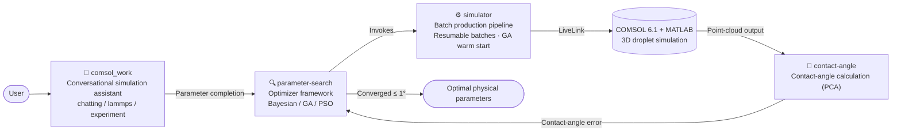

<div align="center">

# 💧 Simulator

**Autonomous Simulation and Parameter Search System for Droplet Contact Angles**

LLM multi-agent × COMSOL/MATLAB/LAMMPS co-simulation × inverse parameter search

**English** | [简体中文](./README_cn.md)

[](https://www.python.org/)
[](https://www.comsol.com/)
[](https://www.mathworks.com/)
[]()
[](./LICENSE)

[Overview](#-overview) · [Architecture](#-architecture) · [Quick Start](#-quick-start) · [Directory Structure](#-directory-structure) · [Data Availability](#-data-availability) · [Citation](#-citation)

</div>

---

## 📖 Overview

In contact-angle simulations of liquid-metal droplets (e.g., GaInSn), the results depend on many physical parameters that are **missing or inaccurate** (surface tension, density, viscosity, substrate thermophysical properties, temperature, etc.). This project builds a complete stack spanning
**conversational simulation assistant → multi-optimizer parameter search → batch production pipeline → contact-angle post-processing**:

> Using experimental contact-angle data as the target, the system automatically inverts **13 physical parameters** so that COMSOL simulations converge to the measured values (tolerance ±1°).

## ✨ Features

- 🔍 **Three production-validated optimizers** — Bayesian optimization (scikit-optimize), genetic algorithm (DEAP) and particle swarm optimization (PSO), sharing a unified parameter-space and objective-function abstraction
- 🤖 **LLM multi-agent assistant** — intent-driven knowledge Q&A / LAMMPS material-property support / autonomous parameter completion for 3D simulations
- ⏯️ **Resumable batches** — progress is persisted per experiment; after an interruption, completed experiments are skipped automatically on restart
- 🔥 **GA warm start** — unconverged experiments resume evolution from their historical traces; seeded individuals carry their known fitness, so no simulation evaluations are spent twice
- 🔒 **Concurrency safety** — file locks serialize COMSOL evaluations, stale locks are reclaimed automatically, and multiple isolated instances are supported
- 📊 **Analysis toolchain** — optimization-trajectory analysis, single-/multi-parameter sensitivity analysis, and point-cloud contact-angle calculation (PCA)

## 🧩 Architecture



## 📦 Requirements

| Dependency | Notes |
|---|---|
|  | `numpy scipy pandas scikit-optimize deap scikit-learn matplotlib openai` |
|  Multiphysics | With LiveLink for MATLAB |
|  | Batch mode `matlab -batch` |
| DeepSeek API | Only needed for the conversational assistant: `export DEEPSEEK_API_KEY=sk-...` |

## 🚀 Quick Start

```bash
# Clone
git clone https://github.com/miandui-wubo/simulator-open.git
cd simulator-open

# 1) Prepare the experiment definition CSV (columns: experiment_id, target contact angle,
#    material, substrate temperature, etc.) and place it at input/experiments_preprocessed.csv

# 2) Run the batch parameter search (GA as an example)
bash simulator/run_batch_ga_full.sh
#    Results are written to simulation_workspace/:
#    batch_results_ga/            optimal parameters and convergence status per experiment
#    exp_XXX/optimization_trace/  per-evaluation records

# 3) Analyze the optimization trajectory of a single experiment
python -m simulator.analyze_optimization_trace simulation_workspace/exp_001

# 4) Use the conversational simulation assistant (optional)
cd comsol_work && python main.py
```

<details>
<summary><b>⚙️ Advanced usage</b></summary>

```bash
# Run with a single command (without the wrapper script)
python -m simulator.main --experiments-csv input/experiments_preprocessed.csv \
    --optimizer ga --iterations 30 --tolerance 1.0

# GA warm start: let unconverged experiments resume evolution from their historical traces
SIMULATOR_WARM_START_EXPERIMENTS=exp_014 bash simulator/run_batch_ga_full.sh

# Run the stages sequentially (Bayesian retry → full GA run)
bash simulator/run_sequential_optimizer_batches.sh
```
</details>

## 📁 Directory Structure

```
simulator-open/
├── comsol_work/          # 🤖 Conversational multi-agent simulation assistant
│   ├── main.py           #    Entry point: intent recognition → dispatch to three modes
│   ├── tools/            #    chatting / lammps / experiment tools and COMSOL templates
│   └── prompt/           #    LLM prompts for each mode
├── parameter-search/     # 🔍 Parameter search framework
│   └── src/
│       ├── optimizers/   #    Bayesian / GA / PSO
│       └── core/         #    Parameter-space and objective-function abstractions
├── simulator/            # ⚙️ Batch production pipeline
│   ├── main.py           #    Entry point (python -m simulator.main)
│   ├── run_batch_*.sh    #    Batch scripts per optimizer (UTF-8 / locking / logging)
│   └── sensitivity_*.py  #    Sensitivity analysis tools
├── contact-angle/        # 📐 Point-cloud contact-angle calculation (PCA)
└── input/                # Experiment definitions (user-provided, not tracked)
```

## 📊 Data Availability

This repository provides the source code of the workflow: the conversational simulation assistant, the optimizer framework, the batch production pipeline and the contact-angle post-processing tools, together with the prompts and configuration files they use.

The following materials are **not included** in this repository:

- Original experimental images with calibration metadata
- Complete optimizer trajectories
- Original interface point clouds
- The full solver archive
- The original COMSOL model
- The language-model checkpoint
- The full orchestration environment

These materials are available from the corresponding author upon reasonable request: **[zhenyuwang@ss.pku.edu.cn](mailto:zhenyuwang@ss.pku.edu.cn)**.

## 📝 Citation

This repository accompanies the manuscript:

> **Measurement-operator auditing in an automated gallium droplet simulation and derivative-free optimization workflow**
>
> *Manuscript under review; full citation details will be added upon publication.*

If you use this code in your research, please cite the manuscript above. Citation metadata for the software is provided in [`CITATION.cff`](./CITATION.cff); the **"Cite this repository"** button in the repository sidebar exports it as APA or BibTeX.

## 📄 License

This project is released under the [MIT License](./LICENSE).

<div align="center">

<sub>Built with 💧 COMSOL · MATLAB · Python</sub>

</div>
