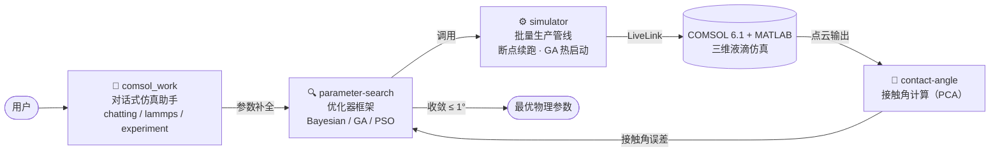

<div align="center">

# 💧 Simulator

**液滴接触角自主仿真与参数搜索系统**

LLM 多智能体 × COMSOL/MATLAB/LAMMPS 联合仿真 × 参数逆向搜索

[](https://www.python.org/)
[](https://www.comsol.com/)
[](https://www.mathworks.com/)
[]()
[](./LICENSE)
[](./CONTRIBUTING.md)

[简介](#-简介) · [系统架构](#-系统架构) · [快速开始](#-快速开始) · [目录结构](#-目录结构)

</div>

---

## 📖 简介

在液态金属（如 GaInSn）液滴的接触角仿真中，仿真结果依赖大量**缺失或不准确**的物性参数
（表面张力、密度、粘度、基板热物性、温度等）。本项目构建了一条从
**对话式仿真助手 → 多优化器参数搜索 → 批量生产管线 → 接触角后处理** 的完整技术栈：

> 以实验接触角数据为目标，自动反演 **13 个物理参数**，使 COMSOL 仿真收敛到实验测量值（容差 ±1°）。

## ✨ 特性

- 🔍 **三种生产验证的优化器** — 贝叶斯优化（scikit-optimize）、遗传算法（DEAP）、粒子群（PSO），统一参数空间与目标函数抽象
- 🤖 **LLM 多智能体助手** — 意图识别驱动的知识问答 / LAMMPS 物性支持 / 自主参数补全三维仿真
- ⏯️ **断点续跑** — 批处理按实验粒度持久化进度，中断重启自动跳过已完成实验
- 🔥 **GA 热启动** — 未收敛实验从历史 trace 接续进化，种子个体携带已知适应度，不重复消耗仿真评估
- 🔒 **并发安全** — 文件锁串行化 COMSOL 评估、陈旧锁自动回收，支持多实例隔离
- 📊 **分析工具链** — 优化轨迹分析、单/多参数敏感性分析、点云接触角计算（PCA）

## 🏗️ 系统架构



## 📦 环境依赖

| 依赖 | 说明 |
|---|---|
|  | `numpy scipy pandas scikit-optimize deap scikit-learn matplotlib openai` |
|  Multiphysics | 含 LiveLink for MATLAB |
|  | 批处理模式 `matlab -batch` |
| DeepSeek API | 仅对话助手需要：`export DEEPSEEK_API_KEY=sk-...` |

## 🚀 快速开始

```bash
# 克隆
git clone https://github.com/miandui-wubo/simulator-open.git
cd simulator-open

# 1) 准备实验定义 CSV（experiment_id、目标接触角、材料、基板温度等列）
#    放到 input/experiments_preprocessed.csv

# 2) 批量参数搜索（以 GA 为例）
bash simulator/run_batch_ga_full.sh
#    结果输出到 simulation_workspace/：
#    batch_results_ga/            各实验最优参数与收敛状态
#    exp_XXX/optimization_trace/  逐次评估记录

# 3) 分析单个实验的优化轨迹
python -m simulator.analyze_optimization_trace simulation_workspace/exp_001

# 4) 对话式使用仿真助手（可选）
cd comsol_work && python main.py
```

<details>
<summary><b>⚙️ 进阶用法</b></summary>

```bash
# 单命令运行（不经封装脚本）
python -m simulator.main --experiments-csv input/experiments_preprocessed.csv \
    --optimizer ga --iterations 30 --tolerance 1.0

# GA 热启动：让未收敛实验从历史 trace 接续进化
SIMULATOR_WARM_START_EXPERIMENTS=exp_014 bash simulator/run_batch_ga_full.sh

# 按阶段顺序执行（Bayesian 重试 → GA 全量）
bash simulator/run_sequential_optimizer_batches.sh
```
</details>

## 📁 目录结构

```
simulator-open/
├── comsol_work/          # 🤖 对话式多智能体仿真助手
│   ├── main.py           #    入口：意图识别 → 分发三种模式
│   ├── tools/            #    chatting / lammps / experiment 工具与 COMSOL 模板
│   └── prompt/           #    各模式 LLM 提示词
├── parameter-search/     # 🔍 参数搜索算法框架
│   └── src/
│       ├── optimizers/   #    Bayesian / GA / PSO
│       └── core/         #    参数空间与目标函数抽象
├── simulator/            # ⚙️ 批量生产管线
│   ├── main.py           #    入口（python -m simulator.main）
│   ├── run_batch_*.sh    #    各优化器批处理脚本（UTF-8 / 锁 / 日志）
│   └── sensitivity_*.py  #    敏感性分析工具
├── contact-angle/        # 📐 点云接触角计算（PCA）
└── input/                # 实验定义（自行准备，不入库）
```

## 🤝 贡献

欢迎 Issue 与 PR！提交前请确保：

- [ ] 代码通过 `python -m py_compile` 检查
- [ ] 不引入数据文件、仿真产物或密钥（API key 一律走环境变量）

## 📄 许可证

本项目基于 [MIT License](./LICENSE) 开源。

<div align="center">

<sub>Built with 💧 COMSOL · MATLAB · Python</sub>

</div>
